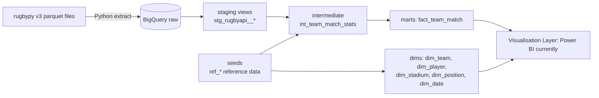

# Rugby Analytics

An end-to-end analytics project built on Premiership Rugby data: Python ingestion into BigQuery, then a dbt dimensional model on top. The goal is a set of marts that can answer real coaching and scouting questions, and eventually a Claude API layer that writes scouting reports from them.

I built it to keep my own hands-on skills current (Python, dbt, BigQuery) after years of leading data teams, and because I wanted a data set I actually care about. It's a work in progress, and this README says honestly what exists and what doesn't yet.

## Stack

- **Ingestion:** Python (pandas, requests, google-cloud-bigquery), reading the rugbypy v3 parquet files
- **Warehouse:** Google BigQuery (EU), datasets `raw` and `rugby_dbt`
- **Transformation:** dbt-core with dbt-bigquery and dbt_utils
- **Planned:** Claude API for generated scouting reports

## How the data flows



## Scope

The extract is deliberately limited to one competition and one season: the Premiership, 2025/26. That keeps runs fast and the data small enough to check by eye. Widening it is mostly a change to three constants in the extract script.

## The model

**Fact**

- `fact_team_match`, where the grain is **one row per team per match**. Each fixture produces two rows, one from each side's point of view, with an `is_home` / `is_away` flag and that team's stats (tries, carries, tackles, ruck speed, set piece, discipline and so on). I chose this grain over one row per match because most questions are about a team's performance ("how does Saints' ruck speed change away from home?"), and it avoids pairs of `home_x` / `away_x` columns everywhere.

**Dimensions**

- `dim_team`: club reference data, linked to the home stadium
- `dim_player`: players, with their most frequent position worked out from match appearances
- `dim_stadium`: home grounds plus the marquee-match venues. I first tried a full many-to-many between teams and grounds, but it added complexity nothing actually needed, so I simplified it.
- `dim_position`: positions 1–23, grouped into units (forwards and backs) and position groups
- `dim_date`: a standard calendar dimension

Surrogate keys come from a small adapter-dispatched macro (`int_surrogate_key`), with implementations for BigQuery and Redshift, so the models aren't tied to one warehouse.

## Data quality problems solved in the model

The source data is messy, and most of the interesting work is in `int_team_match_stats`:

- **Inconsistent team names and IDs.** The same club appears as "Northampton" and "Northampton Saints", sometimes under more than one ID. The `ref_team_name_mapping` seed resolves them to one team.
- **Wrong home and away labels.** The source's own home team label isn't always right. The true home side is resolved in priority order: a manual override for known one-off fixtures, then the venue's usual home club, then the source label.
- **Duplicate fixtures.** Some matches are ingested twice under different IDs, occasionally with the team names swapped but the scores left in place. Duplicates are found on date, teams and score pair, and only the self-consistent record is kept.
- **Sparse team stats.** The source's per-team files only hold a handful of this season's matches for each club. Player stats are much more complete. This is a limitation of the source, so some team-level metrics are thin for now.

Reference seeds have dbt tests (unique, not null, accepted values), and columns are documented with `` blocks.

## Status

**Done**

- [x] Python extract into BigQuery `raw`
- [x] Staging models and reference seeds with tests
- [x] Dimensions for team, player, stadium, position and date
- [x] `fact_team_match`

**Next**

- [ ] A player-per-match fact
- [ ] dbt tests on the marts (key uniqueness, relationships)
- [ ] Move the one-off corrections in `scripts/Data_Fixes.sql` into the model, so raw data stays untouched
- [ ] Claude API scouting report layer

## Running it

```bash
python -m venv .venv && source .venv/bin/activate
pip install dbt-bigquery pandas pyarrow requests google-cloud-bigquery
python scripts/extract_rugbypy_to_bigquery.py   # load raw
dbt deps && dbt seed && dbt build
```

You'll need your own GCP project and a dbt `profiles.yml` pointing at it. Credentials aren't committed.

## Credits

The data comes from the [rugbypy](https://github.com/seanyboi/rugbypy) project ([rugbydata](https://github.com/seanyboi/rugbydata)).
